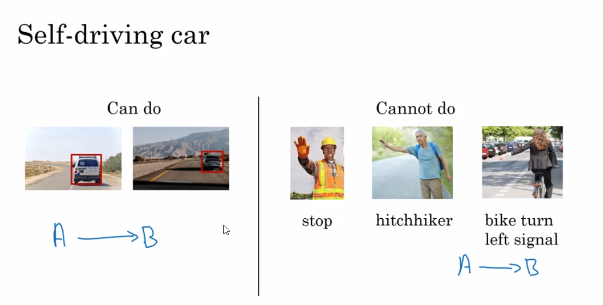

## Week 1
* Complex problems to solve:
* 
* The core difference between AI and data science project
* AI playbook transformation
* <= 1 sec then its posssible for AI to work on

## Week 2
* No need for Big data
* Selection of ML projects
  * Automate the tasks rather than the automate the jobs
* common frameworks:
* 

## Week 3:

* it may take 2 to 3 weeks for to be intelligent.
